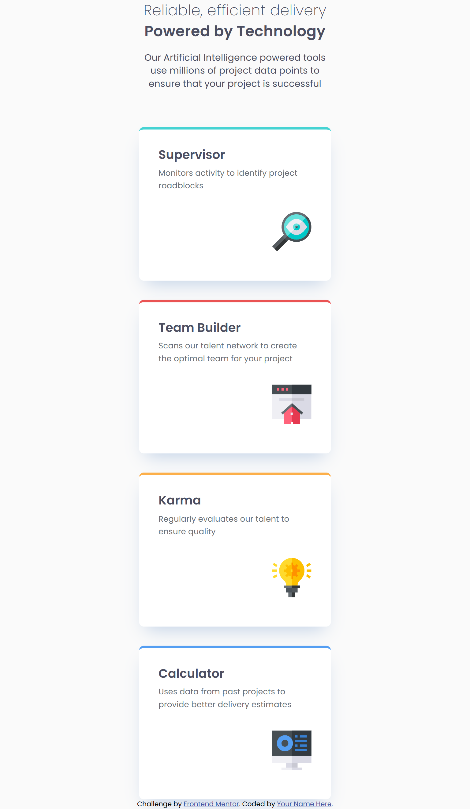

# Frontend Mentor - Four card feature section

## Table of contents

- [Overview](#overview)
  - [The challenge](#the-challenge)
  - [Screenshot](#screenshot)
  - [Links](#links)
- [My process](#my-process)
  - [Built with](#built-with)
  - [What I learned](#what-i-learned)
  - [Continued development](#continued-development)
  - [Useful resources](#useful-resources)
  - [AI Collaboration](#ai-collaboration)
- [Author](#author)

## Overview

### The challenge

Users should be able to:
- View the optimal layout depending on their device's screen size

### Screenshot

### Links

- Solution URL: [[Add solution URL here](https://www.frontendmentor.io/solutions/four-card-feature-section-css-grid-sass-mobile-first-fOZQYF-7tt)]
- Live Site URL: [https://maxi1993-tech.github.io/four-card-picture-section/](https://maxi1993-tech.github.io/four-card-picture-section/)

## My process

### Built with

- Semantic HTML5 markup
- CSS custom properties
- CSS Grid
- Flexbox
- Sass
- Mobile-first workflow

### What I learned

I discovered CSS Grid in a real project for the first time. Mobile layout wasn't a problem, but positioning items on desktop was really complex. Sass is also starting to make more sense.

### Continued development

Continue practicing Grid and Flexbox on real projects, refine my use of relative units and keep improving with Sass.

### Useful resources

- [MDN Web Docs](https://developer.mozilla.org) - My go-to reference for CSS Grid properties and values.

### AI Collaboration

Used Claude for HTML/CSS reviews, semantics and best practices questions. For the desktop Grid layout, I needed some more direct guidance when things got complex.

## Author

- Frontend Mentor - [@maxi1993-tech](https://www.frontendmentor.io/profile/maxi1993-tech)
- GitHub - [maxi1993-tech](https://github.com/maxi1993-tech)